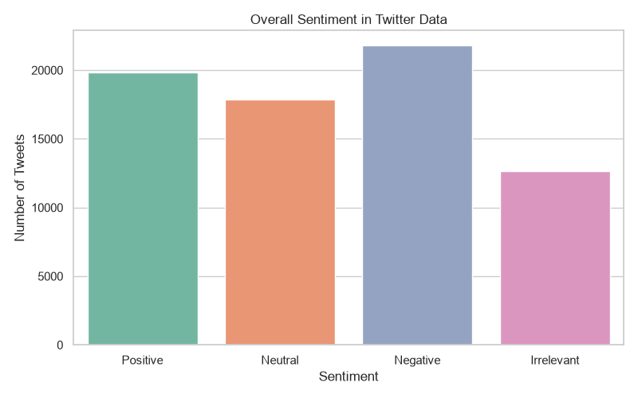
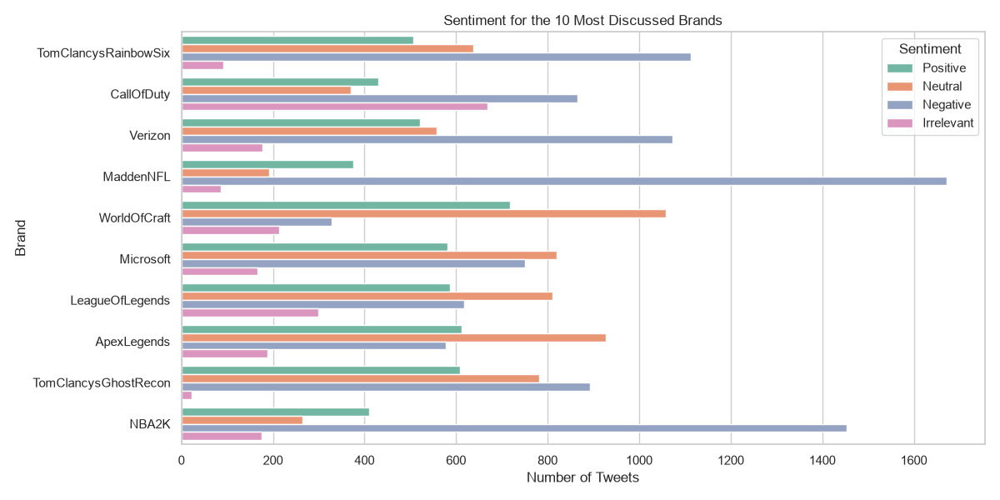
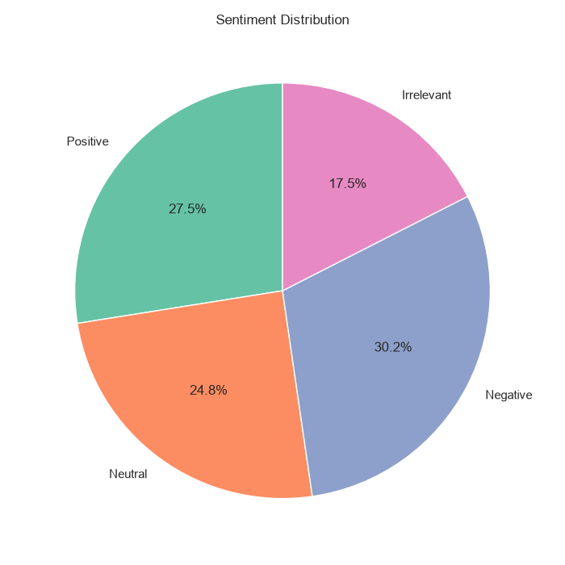

# Twitter Sentiment Analysis

This project explores sentiment in a Twitter dataset across four labels: **Positive**, **Neutral**, **Negative**, and **Irrelevant**. It combines the training and validation files, cleans tweet text, and creates clear visual summaries of overall and brand-level sentiment.

## Features

- Loads the provided Twitter training and validation datasets.
- Removes rows without tweet text and duplicate records.
- Cleans tweets by removing URLs, @mentions, and extra whitespace.
- Prints the total cleaned tweet count and sentiment-class counts.
- Saves three visualisations to the `output/` directory:
  - overall sentiment count chart;
  - sentiment breakdown for the 10 most-discussed brands;
  - sentiment percentage pie chart.

## Project structure

```text
DS_Task_4/
├── sentiment_analysis.py       # Analysis and chart generation script
├── twitter_training.csv        # Training data
├── twitter_validation.csv      # Validation data
├── requirements.txt            # Python dependencies
└── output/                     # Generated charts
    ├── sentiment_count.png
    ├── brand_sentiment.png
    └── sentiment_pie_chart.png
```

## Requirements

- Python 3.8 or later
- `pandas`
- `matplotlib`
- `seaborn`

Install the dependencies from the project folder:

```bash
pip install -r requirements.txt
```

## Usage

Keep `twitter_training.csv` and `twitter_validation.csv` in the same directory as the script, then run:

```bash
python sentiment_analysis.py
```

The script creates the `output/` folder automatically if it does not already exist. On completion, it prints the cleaned-record total and class distribution, then saves the charts there.

## Dataset format

The input CSV files have no header row. The script assigns these columns while loading them:

| Column | Description |
| --- | --- |
| `tweet_id` | Identifier for the tweet record |
| `brand` | Brand or topic associated with the tweet |
| `sentiment` | Sentiment label |
| `tweet` | Original tweet text |

## Output preview

### Overall sentiment count



### Sentiment by most-discussed brands



### Sentiment distribution



## Notes

`Irrelevant` is retained as a separate dataset class rather than being merged into neutral sentiment. The charts use the fixed label order: Positive, Neutral, Negative, and Irrelevant.
